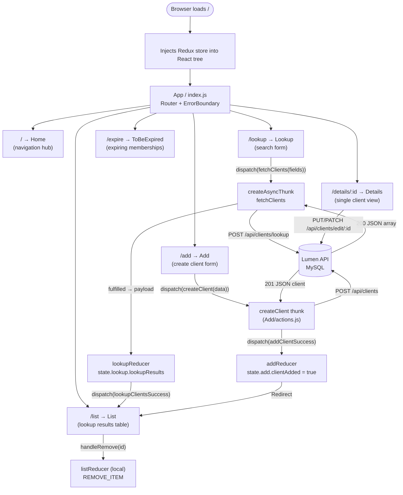
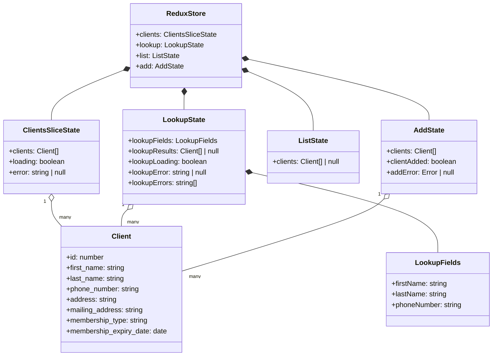
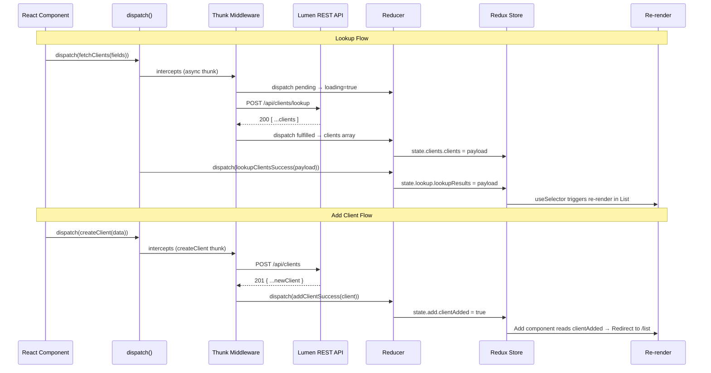

# Clients Management App — Architecture

Tech stack: React 17 · Redux Toolkit · React Router DOM v5 · Axios · Semantic UI React · Laravel Lumen · MySQL

---

## Application Flow Chart



---

## Redux State Data Model



---

## API Endpoints (Lumen Backend)

```mermaid
flowchart LR
    subgraph "GET"
        G1[GET /api/clients/] --> idx[ClientController@index\nReturn all clients]
        G2[GET /api/clients/details/:id] --> show[ClientController@show\nReturn one client]
        G3[GET /api/clients/expire] --> exp[ClientController@toBeExpired\nExpiring in 30 days]
    end
    subgraph "POST"
        P1[POST /api/clients/] --> create[ClientController@create\nValidate + INSERT]
        P2[POST /api/clients/lookup] --> lookup[ClientController@lookup\nSearch by name/phone]
    end
    subgraph "PUT/PATCH/DELETE"
        U1["PUT|PATCH /api/clients/edit/:id"] --> update[ClientController@update\nUpdate fields]
        D1[DELETE /api/clients/delete/:id] --> del[ClientController@delete\nSoft/hard delete]
    end
```

---

## Action / Reducer Flow


